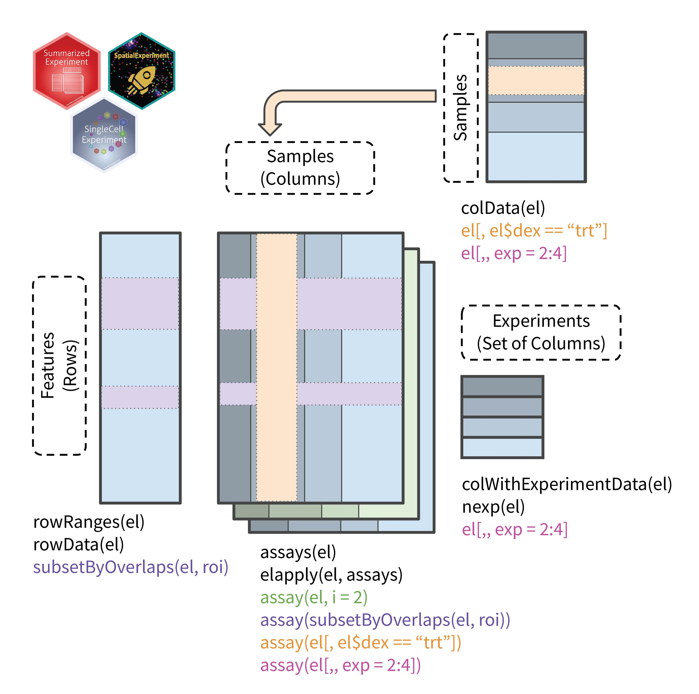

```{r, include = FALSE}
knitr::opts_chunk$set(
  collapse = TRUE,
  warning = FALSE,
  message = FALSE,
  comment = "#>"
)
```

# Motivation

The advent of high throughput molecular measurement technologies has resulted in the generation of vast amounts of data. The `SummarizedExperiment` object and its derivates have assisted in hosting data from these technologies. The `SingleCellExperiment` and `SpatialExperiment` objects are able to store even higher resolution single-cell and spatial transcriptomics measurements from a single biological sample respectively. Reduced costs has enabled the generation of these data from multiple biological samples. Such data is not easily stored and manupilated within a single object. Concatenation of objects can partially resolve this data since it can be analysed in unison, however, prevents for sample-wise analysis. Maintaining a list of objects would allow object-wise analysis, but would hinder collective analysis.

The `MultipleExperiment` object is designed to fill in this gap and allows storage and manipulation of multiple `SpatialExperiment`, `SingleCellExperiment`, `RangedSummarizedExperiment` or `SummarizedExperiment` objects. It provides both list-like and object-like functionality thus providing dynamic access to the data as the needs arise. For example, when analysing multiple spatial transcriptomic datasets, users may wish to compute reduced dimensions (e.g., PCA) on each individual object before dataset integration and compute a combined reduced dimension after. In such scenarios, having a hybrid interface to the data is beneficial.

```{r eval=FALSE}
if (!requireNamespace("BiocManager", quietly = TRUE))
    install.packages("BiocManager")

BiocManager::install("MultipleExperiment")
```

# Anatomy of an `MultipleExperiment`

The `MultipleExperiment` object borrows its structure from the object it hosts. When dealing with a list of `SpatialExperiment` objects, all slots from the object are made available therefore the rows contain feature (e.g., gene/transcript) information, the columns represent individual observations (e.g., visium spots), and multiple assays can be stored. The individual objects (different shades in the schematic) are concatenated to create a single `SpatialExperiment` object. The mapping between the original sample and the concatenated columns are maintained using and internal slot (`experimentIndex`). Sample-specific annotation (NOT spot-specific) are held in a `DataFrame` and are linked to the columns of the new `MultipleExperiment` object.

The following schematic demonstrates the structure of the MultipleExperiment object and lists some common accessors to interact with the object.



Under the hood, a separate class is used to hold the list of objects as described in the table below.

| Object class                 | Matched `MultipleExperiment` class   |
|------------------------------|----------------------------------|
| `SummarizedExperiment`       | `SummarizedMultipleExperiment`       |
| `RangedSummarizedExperiment` | `RangedSummarizedMultipleExperiment` |
| `SingleCellExperiment`       | `SingleCellMultipleExperiment`       |
| `SpatialExperiment`          | `SpatialMultipleExperiment`          |

# Constructing an `MultipleExperiment`

The `TENxVisiumData` package contains 10X Visium data from various human and mouse tissues. We will use the breast cancer IDC and ILC datasets from this package to demonstrate the MultipleExperiment container. These data contain measurements of 36601 transcripts measured across 7785 and 4325 spots respectively.

```{r}
library(MultipleExperiment)
library(TENxVisiumData)

#download data
spe1 = TENxVisiumData::HumanBreastCancerIDC()
spe2 = TENxVisiumData::HumanBreastCancerILC()

#remove alt exps - these should be matched across exps (likewise for rownames)
altExps(spe2) = list()

#create a list of objects
spe_list = list(
  'HumanBreastCancerIDC' = spe1,
  'HumanBreastCancerILC' = spe2
)
spe_list
```

Given the individual objects, we first create a sample-specific annotation table and subsequently use it to create an `MultipleExperiment` object. With the data prepared, the object can be constructed using the `MultipleExperiment()` function.

```{r}
#create some artificial experiment annotations
experimentAnnotation = data.frame(
  sex = c('Female', 'Female'),
  age = c(65, 68),
  row.names = c('HumanBreastCancerIDC', 'HumanBreastCancerILC')
)
experimentAnnotation

#create MultipleExperiment objects
el = MultipleExperiment(experiments = spe_list, experimentData = experimentAnnotation)
el
```

The `MultipleExperiment` object can be created without *experimentData* and with an unnamed list. When using a named list, names of the list should be matched with rownames of *experimentData*.

# Common operations on `MultipleExperiment`

## Subsetting

Subsetting can be performed in a similar way to the parental `SummarizedExperiment` object using the `[` function.

```{r}
#subset the first five features and first three samples
el[1:5, 1:3]
```

In addition to this, entire experiments can be subsetted using the `[` function as below.

```{r}
#subset the first five features and all columns from the second experiment
el[1:5, , exp = 2]
```

## Getters and setters

The functions below can be used to access and set data in the object.

- `nexp()`, `experimentNames()`

```{r}
#number of experiments
nexp(el)
#names of experiments
experimentNames(el)
```

- `experiments()`

```{r}
#get a list of individual experiments
experiments(el)
```

- `experimentData()`, `colData()`

```{r}
#get experiment annotations
experimentData(el)
#get column annotations
head(colData(el))
#get column annotations merged with experiment annotations
head(colData(el, experimentData = TRUE))
```

## Apply

The `elapply()` function can be used to apply functions to individual objects.

```{r}
#apply function
elapply(el, dim)
```

If the return type is the same as the type of the individual experiment objects, they will be combined into `MultipleExperiment` object.

```{r}
#get the first 100 spots
elapply(el, function(x) x[, 1:100])
```

This function allows the `MultipleExperiment` object to be treated as a list. Since the parent class of the object is `SpatialExperiment`, all functions that work for it automatically work for the `MultipleExperiment` object.

```{r}
#extract image data for each object separately
elapply(el, imgData)
#extract image data collectively
imgData(el)
```

## Coercion

`MultipleExperiment` objects can be coerced to their parental classes or `MultipleExperiment` versions of their parental classes.

```{r}
#convert to SpatialExperiment
as(el, 'SpatialExperiment')
#convert to SummarizedExperiment
as(el, 'SummarizedExperiment')
#convert to SummarizedMultipleExperiment
as(el, 'SummarizedMultipleExperiment')
```

The full coercion hierarchy can be explored using the `is()` function.

```{r}
is(el)
```

# Session information

```{r}
sessionInfo()
```
